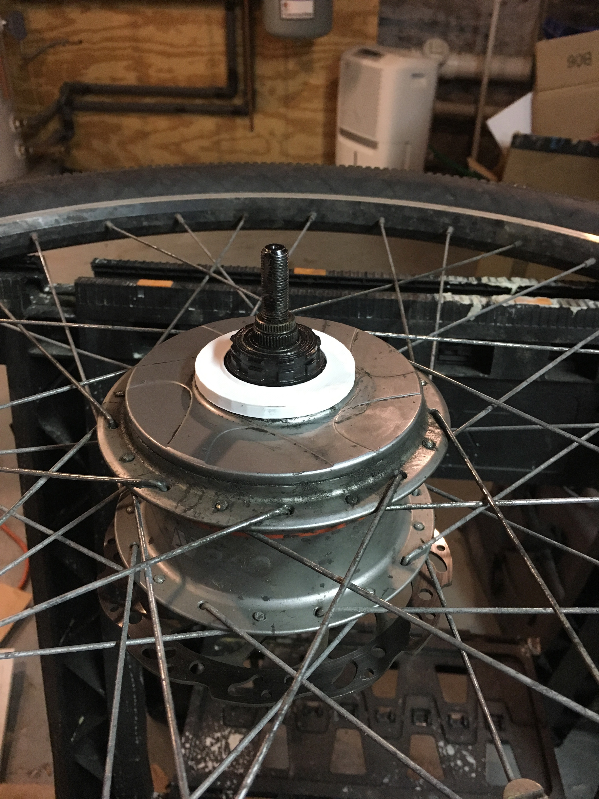

This is a dust cover for a NuVinci bike hub. I had to make this part because NuVinci (Enviolo) doesn't sell this as a spare part, and my chain broke, destroying the thin plastic original one.

The tolerances are quite close, so you may have to scale a few percent to make a tight fit depending on your printer.

